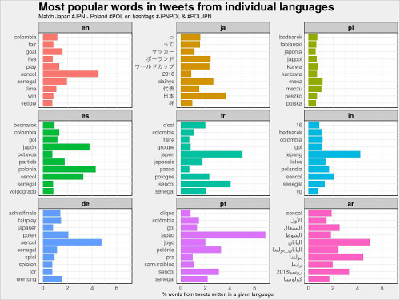
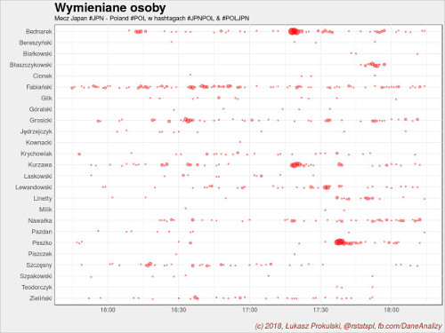
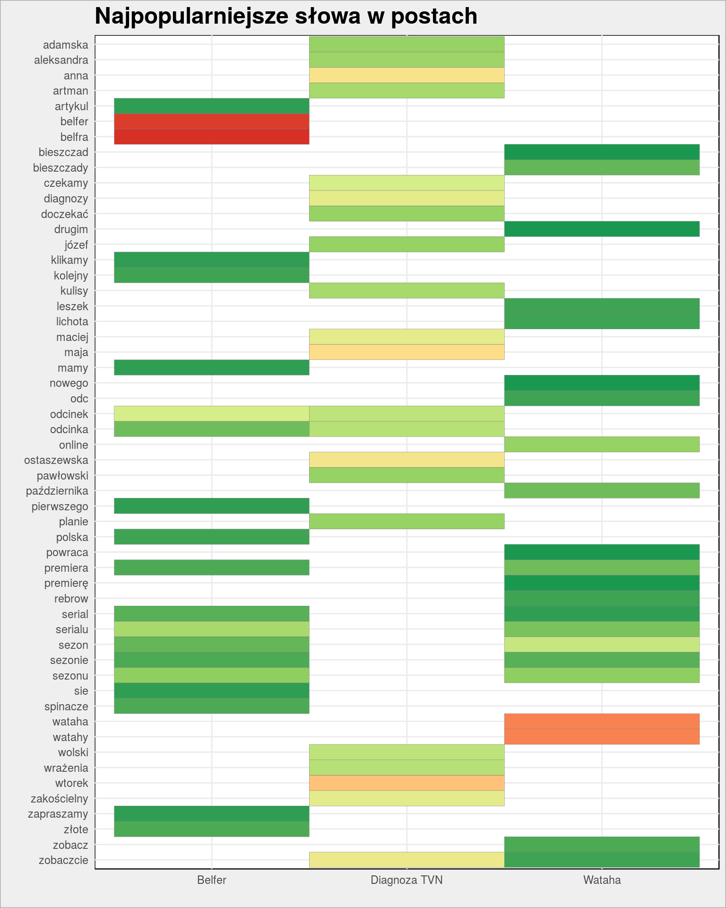
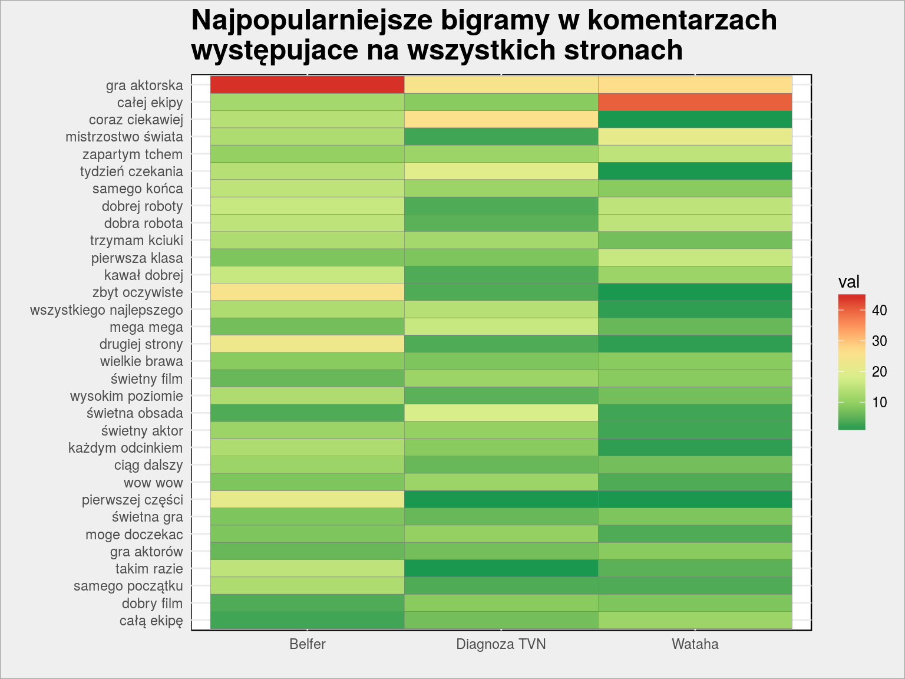
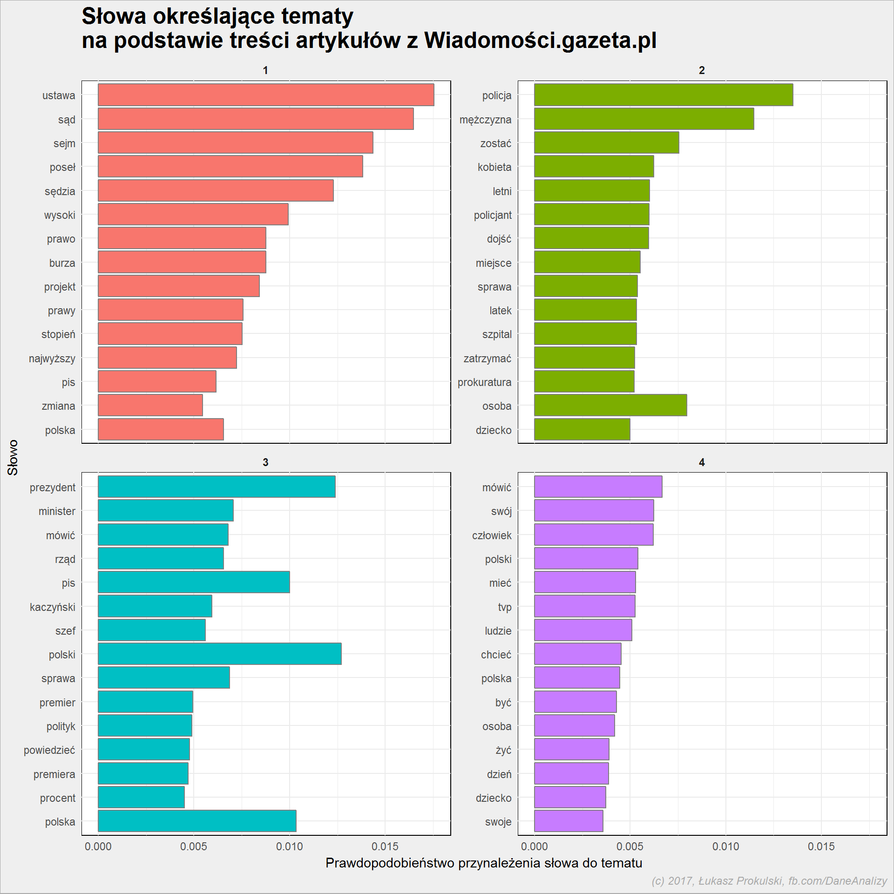
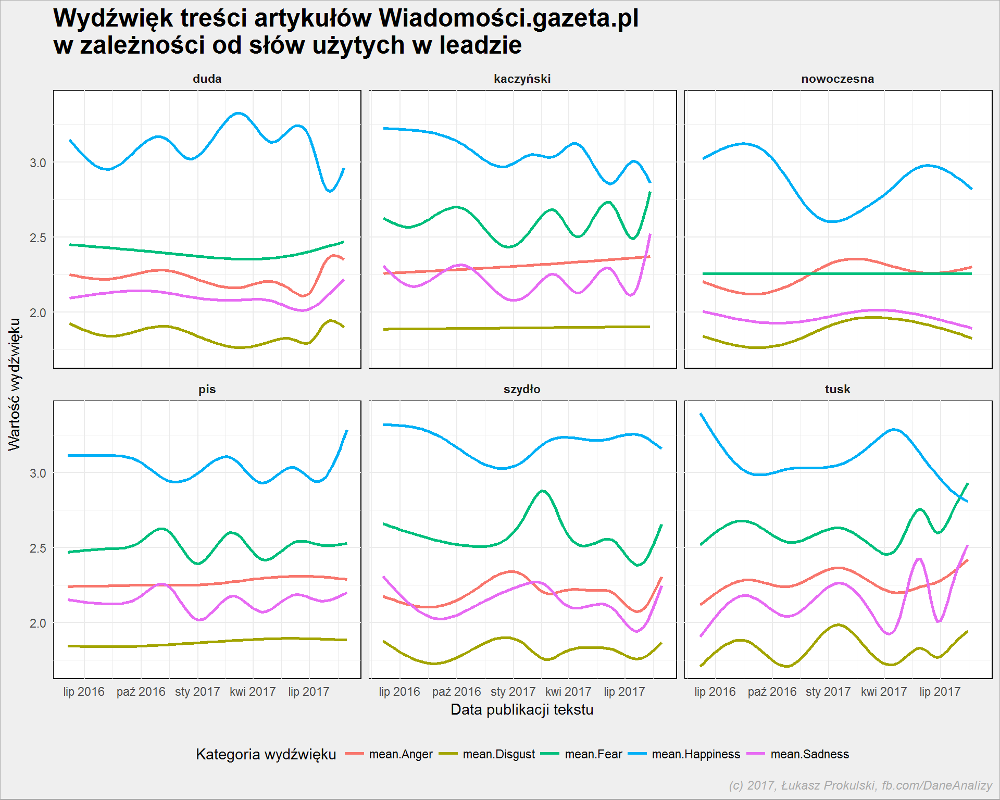

```{r setup, include=FALSE}
knitr::opts_chunk$set(echo = FALSE)
```

## Proponuję zabawę

**Komentowanie na żywo na Twitterze.**

Zasady:

* używamy hashtagu *#rstatspl*
* im więcej tweetów tym lepiej
* tweety o tym co się tutaj dzieje w danej chwili


## {data-background=https://i.giphy.com/media/3oEjI8vagntG7EDxgQ/giphy.webp data-background-size=cover}

# Wstęp

* Co to za kolo?
* Czego chce?

## Ja...

* ...jestem
* ...mam
* ...pracuję
* ...prowadzę

## Po co to wszystko?

* rozpoznawanie spamu
* rozpoznawanie plagiatów
* identyfikacja autorstwa
* identyfikacja tematów, SEO
* analiza sentymentu
* ...


## {data-background=https://i.giphy.com/media/RrVzUOXldFe8M/giphy.webp data-background-size=cover}


# Przygotowanie

Co będzie potrzebne?

## Przygotowanie i podstawowa analiza tekstu

* potrzebne pakiety:
    + tidyverse *(dplyr i ggplot2)*, widyr
    + tidytext, topicmodels, tm
    + wordcloud
    + text2vec
    + e1071, xgboost
* potrzebne pliki (słowniki):
    + stopwords
    + polimorfologik
    + nawl
* GitHub -> https://github.com/prokulski/ML_Forum


## Skąd wziąć dane tekstowe?

* projekt Gutenberg
    + ponad 57 tysięcy książek
    + https://www.gutenberg.org/
* Wolne lektury
    + około 5500 darmowych utworów
    + https://wolnelektury.pl/
* Twitter
* Facebook
* własne bazy - recenzje, opinie, artykuły
* web scrapping


## Twitter

<center></center>

## Twitter

<center></center>

## Facebook

<center></center>

## Facebook

<center></center>

## Web scraping

<center></center>

## Web scraping

<center></center>

Ciekawy jest wzrost wartości *Fear* dla Beaty Szydło w początku 2017 roku...

# Część warsztatowa

* Wreszcie konkrety!
* *Gimme the data!*

## Pobranie plików z Wolne lektury

Wybieramy listę książek:

* **Henryk Sienkiewicz**: *Potop*, *W pustyni i w puszczy*, *Quo vadis*, *Janko Muzykant*
* **Bolesław Prus**: *Faraon*, *Lalka*, *Antek*
* **Stefan Żeromski**: *Przedwiośnie*, *Siłaczka*, *Syzyfowe prace*, *Ludzie bezdomni*
* **Aleksander Dumas**: *Hrabia Monte Christo*, *Trzej muszkieterowie*
* **Rudyard Kipling**: *Księga dżungli*
* **Daniel Defoe**: *Robinson Crusoe*
* **Mark Twain**: *Przygody Tomka Sawyera*
* **Miguel de Cervantes Saavedra**: *Don Kichot z La Manchy*
* **Robert Louis Stevenson**: *Wyspa skarbów*
* **Marcel Proust**: *W stronę Swanna*
* **Joseph Conrad**: *Lord Jim*
* **Władysław Stanisław Reymont**: *Ziemia obiecana*, *Chłopi*
* **Jules Gabriel Verne**: *W osiemdziesiąt dni dookoła świata*
* **Herbert George Wells**: *Wehikuł czasu*

Szukamy ich na Wolnych lekturach i przygotowujemy plik CSV.

## Plik epub

* to archiwum ZIP
* w środku pliki HTML z treścią rozdziału
* z HTMLa pobieramy odpowiednie dane

*skrypt 01.R*

# Analiza tekstów

Mamy dane, to co w nich siedzi?

## {data-background=https://i.giphy.com/media/zsRviQEWP9SHm/giphy.webp data-background-size=cover}


## Analiza tekstów

* podział na słowa
    + *skrypt 02.R*
* podział na bi-gramy
    + *skrypt 02.R*

## Popularność słów wg autora i książki

*skrypt 02.R*

## Stop-words

**prawo Zipfa** - jeżeli dla jakiegokolwiek tekstu lub grupy tekstów ustala się wykaz wyrazów ułożonych w malejącym porządku częstotliwości ich występowania, to ranga rośnie w miarę zwiększania się numeru na wykazie (czyli w miarę zmniejszania się częstotliwości). Oznacza to, że częstotliwość jest odwrotnie proporcjonalna do rangi, czyli iloczyn częstotliwości i rangi powinien być wielkością stałą:

$$r \times f = constans$$

gdzie $r$ jest to ranga wyrazu w tekście lub grupie tekstów, a $f$ częstotliwość jego występowania.

*skrypt 02.R*

## Popularność słów wg autora i książki

**Tym razem bez stop-words**

*skrypt 02.R*

## {data-background=https://i.giphy.com/media/31lPv5L3aIvTi/giphy.webp data-background-size=cover}


## Stemming

**Stemming** – w wyszukiwaniu informacji oraz w morfologii (w językoznawstwie) jest to proces usunięcia ze słowa końcówki fleksyjnej pozostawiając tylko temat wyrazu. Proces stemmingu może być przeprowadzany w celu zmierzenia popularności danego słowa. 

* Słownik dla języka polskiego - polimorfologik

Przykład dla polskich słów

*skrypt 02.R*


## Popularność słów wg autora i książki

* **Bez stop-words i po steammingu**
    + *skrypt 02.R*
* Chmurka słów według książki
    + *skrypt 02.R*
* Popularność słów według rozdziałów
    + *skrypt 02.R*
* popularność połączeń słów w bi-gramach
    + *skrypt 02.R*


## {data-background=https://i.giphy.com/media/cAMkmKXTqzYru/giphy.webp data-background-size=cover}

## Analiza sentymentu

Słowa niosą emocje. Jakie emocje niesie cały tekst?

* Słownik dla języka polskiego - nawl

* sentyment według autora
* sentyment według książki
* sentyment w trakcie książki
    + **Kurt Vonnegut on the Shapes of Stories** -> https://www.youtube.com/watch?v=oP3c1h8v2ZQ
    + **The emotional arcs of stories are dominated by six basic shapes** - https://arxiv.org/pdf/1606.07772v2.pdf
* *skrypt 03.R*


## TF-IDF

**Term Frequency–Inverse Document Frequency** to jedna z metod obliczania wagi słów w oparciu o liczbę ich wystąpień, należąca do grupy algorytmów obliczających statystyczne wagi termów. Każdy dokument reprezentowany jest przez wektor, składający się z wag słów występujących w tym dokumencie. TFIDF informuje o częstości wystąpienia termów uwzględniając jednocześnie odpowiednie wyważenie znaczenia lokalnego termu i jego znaczenia w kontekście pełnej kolekcji dokumentów.

Wartość TF-IDF oblicza się ze wzoru:

$${(tf\mbox{-}idf)_{i,j}} = {tf_{i,j}} \times {idf_{i}}$$

## TF-IDF - matematyka

$${(tf\mbox{-}idf)_{i,j}} = {tf_{i,j}} \times {idf_{i}}$$

gdzie $tf_{i,j}$ to tzw. "term frequency", wyrażana wzorem:

$${tf_{i,j}} = {\frac {n_{i,j}}{\sum _{k}n_{k,j}}}$$

gdzie:

* $n_{i,j}$ jest liczbą wystąpień termu ($t_{i}$) w dokumencie $d_{j}$
* a mianownik jest sumą liczby wystąpień wszystkich termów w dokumencie $d_{j}$.


$idf_{i}$ to "inverse document frequency", wyrażana wzorem:

$${idf_{i}} =  \ln \frac{|D|}{|\{d: t_{i} \in d\}|}$$

gdzie:

* $|D|$ to liczba dokumentów w korpusie
* $|\{d : t_{i} \in d\}|$ to liczba dokumentów zawierających przynajmniej jedno wystąpienie danego termu.

## {data-background=https://i.giphy.com/media/bqalUGFYfyHzW/giphy.webp data-background-size=cover}

## TF-IDF - przykład 1

Załóżmy, że:

* doc1 = "to jest przykład"
* doc2 = "a to jest to inne zdanie"

**Wówczas mamy:**

* tf("to", doc1) = 1/3
* tf("to", doc2) = 2/6

* idf("to", DOC) = ln(2/2) = 0

* tf-idf("to", doc1) = 1/3 * 0 = 0
* tf-idf("to", doc2) = 2/6 * 0 = 0

## TF-IDF - przykład 2

* tf("przykład", doc1) = 1/3
* idf("przykład", DOC) = ln(2/1) = 0.693
* tf-idf("przykład", doc1) = 1/3 * 0.693 = 0.231

*skrypt 04.R*

## Rozpoznawanie tematów

* każdy dokument to zbiór słów z różnych dziedzin (tematów). Na przykład
    + dokument 1 to w 90% słowa z tematu A oraz 10% słów z tematu B
    + dokument 2 to 30% słów z tematu A i 70% z tematu B
    + można więc wnioskować, że dokument 1 dotyczy tematu A, dokument 2 – tematu B
* każdy temat to również zbiór słów; niektóre słowa w danym temacie pojawiają się częściej niż w innych tematach. Dla przykładu:
    + słowa *pieniądze*, *biznes*, *umowa* – pojawiają się w tematach o sprawach gospodarczych
    + słowa *reżyser*, *rola*, *aktor*, *scena* – w tematach związanych z filmem
    + oczywiście są słowa, które mogą pojawić się w obu tematach – w naszym przykładzie może to być *budżet*
* LDA (*Latent Dirichlet allocation*) to matematyczne metody połączenia jednego z drugim - dzięki temu znajdziemy słowa charakterystyczne dla tematu, jak i dokumenty pasujące do niego.


## {data-background=https://i.giphy.com/media/BmmfETghGOPrW/giphy.webp data-background-size=cover}


## DTM - Document-Term-Matrix

* w wierszach - dokumenty
* w kolumnach - słowa
* wartości - liczba wystąpień słowa w dokumencie

*skrypt 04.R*

## LDA

* **beta**:  Word-topic probabilities - jakie słowa określają temat?
    + *skrypt 04.R*

* **gamma**: Document-topic probabilities - jakie dokumenty pasują do tematu?
    + *skrypt 04.R*

## LDA - przykład rzeczywisty

*skrypt 05.R*

## Word2Vec

$$Berlin = Paryż - Francja + Niemcy$$

Reprezentacja słów jako wektory

* jak zrobić, na całym zbiorze, działania na słowach
* GloVe
   + https://dumps.wikimedia.org/enwiki/latest/
   + pliki kończące się na *pages-articles.xml.bz2* (najnowszy ~15GB)
   + *skrypt 06.R*


# Zagadka kryminalna

Ej, a coś ciekawego?

## Pytanie do publiczności

Przed kolejnym krokiem proszę o napisanie na kartce trzech informacji:

* nazwa uczelni
* rok ukończenia studiów
* tytuł pracy magisterskiej

## {data-background=https://i.giphy.com/media/3o6ZsT9l5Z5SfCovQI/giphy.webp data-background-size=cover}

## Kto napisał tę książkę? - doc2vec

* Oznaczamy książkę nieznanego autora
* cały zbiór dzielimy na słowa
* budujemy macierz TDM gdzie dokument to autor, a term to kolejne słowa
   + jest to lista wektorów w przestrzeni słów, po jednym wektorze dla każdego autora
* liczymy podobieństwo wektorów jako ich odległość kosinusową:
$$podobienstwo = cos(\theta) = \frac{A \cdot B}{|A| |B|} = \frac{\sum \limits _{i=1}^{n}{A_{i}B_{i}}}{{\sqrt {\sum \limits _{i=1}^{n}{A_{i}^{2}}}}{\sqrt {\sum \limits _{i=1}^{n}{B_{i}^{2}}}}}$$
* *skrypt 07b.R*

# Dodatek polityczny (nieco) {data-background=https://cdn.natemat.pl/4aabf3d99643077a421b9d6ac089aaee.jpg data-background-size=cover}
 
Kto pisze przemówienia Andrzeja Dudy?

## Analiza

* https://www.youtube.com/watch?v=wf4o6rYaPCI

* Źródło danych
   + otwieramy przeglądarki
   + http://www.prezydent.pl/aktualnosci/wypowiedzi-prezydenta-rp/wystapienia/
* Pobieramy dane
   + *skrypt 09.R*
* Najpopularniejsze słowa
   + *skrypt 09.R*
* O kim mowa - Kaczyński, Szydło czy Morawiecki, Macierewicz?
   + *skrypt 09.R*
* Czy przemówienia są podobne do siebie? 
   + *skrypt 09.R*
* Najbardziej podobne wystąpienia
   + *skrypt 09.R*
* Czy pisze to ta sama osoba?
   + *skrypt 09.R*

# Zakończenie

Ziomek, skończyłeś?


## Analiza Twittera

Sprawdźmy co tam napisaliście...

*skrypt 10.R*

## Pytania?

**Śmiało**, czas się kończy!


## {data-background=https://i.giphy.com/media/dXICCcws9oxxK/giphy.webp data-background-size=cover}


## Zapraszam

* Blog -> http://prokulski.net
* Facebook -> http://fb.com/DaneAnalizy
* GitHub -> https://github.com/prokulski/


# Dziękuję

## {data-background=https://i.giphy.com/media/3otPoFUlMjMfm8nujC/giphy.webp data-background-size=cover}
